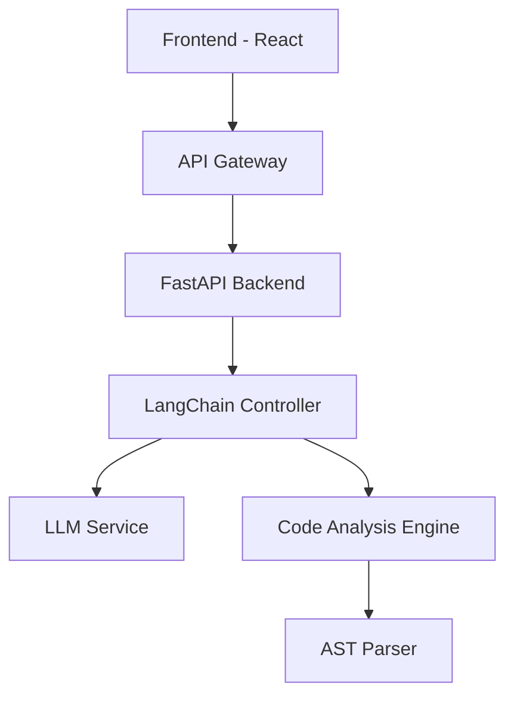

## System Architecture Deep Dive

Today, I'm sharing the technical details of how I built XCode2YCode, focusing on the architecture decisions and implementation challenges.

### The Challenge
Converting code between programming languages while maintaining:
- Semantic correctness
- Code style conventions
- Performance optimization
- Error handling patterns

### Architecture Overview



### Key Components

1. **Frontend Layer**
```typescript
// React component for code input
const CodeInput: React.FC = () => {
  const [code, setCode] = useState<string>('');
  const [targetLang, setTargetLang] = useState<string>('python');
  
  const handleTranslation = async () => {
    const result = await translateCode(code, targetLang);
    // Handle result
  };
  
  return (
    // Component JSX
  );
};
```

2. **Backend API**
```python
from fastapi import FastAPI, HTTPException
from langchain import LLMChain

app = FastAPI()

@app.post("/translate")
async def translate_code(
    source_code: str,
    target_language: str
) -> dict:
    try:
        result = await translation_chain.arun(
            code=source_code,
            target=target_language
        )
        return {"translated_code": result}
    except Exception as e:
        raise HTTPException(status_code=500, str(e))
```

### Performance Optimizations

1. **Caching Layer**
```python
from functools import lru_cache

@lru_cache(maxsize=1000)
def get_translation_chain(model_name: str) -> LLMChain:
    return create_optimized_chain(model_name)
```

2. **Batch Processing**
```python
async def process_batch(
    codes: List[str],
    batch_size: int = 5
) -> List[str]:
    results = []
    for i in range(0, len(codes), batch_size):
        batch = codes[i:i + batch_size]
        tasks = [translate_single(code) for code in batch]
        batch_results = await asyncio.gather(*tasks)
        results.extend(batch_results)
    return results
```

### Error Handling & Validation

```python
def validate_code_structure(code: str) -> bool:
    try:
        ast.parse(code)
        return True
    except SyntaxError:
        return False

class ValidationError(Exception):
    pass

def ensure_valid_translation(
    original: str,
    translated: str,
    target_lang: str
) -> str:
    if not is_valid_syntax(translated, target_lang):
        raise ValidationError("Invalid translation")
    return translated
```

## Lessons Learned

1. **Prompt Engineering is Crucial**
- Carefully crafted prompts improve translation accuracy
- Context windows need optimization
- Temperature settings affect code style

2. **Performance Considerations**
- Async processing for better throughput
- Caching frequently used translations
- Batch processing for multiple files

3. **Error Handling**
- Robust validation at each step
- Graceful fallbacks for failed translations
- Comprehensive logging for debugging

## Future Improvements

1. **Enhanced Language Support**
- Add support for more programming languages
- Improve handling of language-specific features
- Better type system translations

2. **Performance Optimizations**
- Implement distributed processing
- Add more caching layers
- Optimize prompt lengths

3. **Developer Experience**
- IDE integrations
- CLI tool
- API client libraries

[View the project on GitHub →](https://github.com/ShamalShaikh/XCode2YCode) 