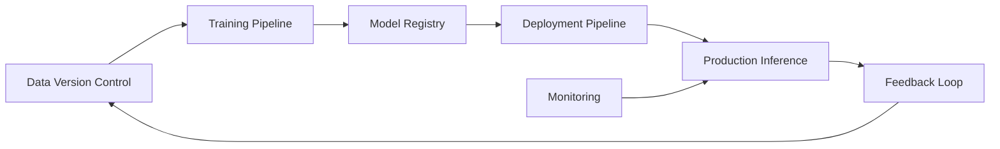

## Building a Modern MLOps Pipeline

This guide walks through setting up a complete MLOps pipeline, from experiment tracking to production deployment, using industry-standard tools.

### Pipeline Architecture Overview



### 1. Data Version Control Setup

```python
# Initialize DVC with remote storage
import dvc.api
from pathlib import Path

def setup_dvc():
    # Initialize DVC repository
    Path('.dvc').mkdir(exist_ok=True)
    
    # Configure remote storage (e.g., S3)
    dvc.config.Config(
        remote={
            'name': 'myremote',
            'url': 's3://my-bucket/dvc-store'
        }
    )

# Track datasets
def version_dataset(data_path: str, version: str):
    """Version control datasets with DVC"""
    import dvc.api
    
    with dvc.api.open(
        data_path,
        mode='w',
        rev=version
    ) as f:
        # Save dataset metadata
        f.write(f"Version: {version}\n")
```

### 2. Training Pipeline with MLflow

```python
import mlflow
from sklearn.model_selection import train_test_split
from typing import Dict, Any

class MLTrainingPipeline:
    def __init__(self, experiment_name: str):
        mlflow.set_experiment(experiment_name)
        self.experiment = mlflow.get_experiment_by_name(experiment_name)

    def train(self, config: Dict[str, Any]):
        with mlflow.start_run():
            # Log parameters
            mlflow.log_params(config)
            
            # Train model
            model = self._train_model(config)
            
            # Log metrics
            metrics = self._evaluate_model(model)
            mlflow.log_metrics(metrics)
            
            # Log model
            mlflow.sklearn.log_model(
                model,
                "model",
                registered_model_name=config['model_name']
            )
            
            return model, metrics

    def _train_model(self, config: Dict[str, Any]):
        # Implementation of model training
        pass

    def _evaluate_model(self, model) -> Dict[str, float]:
        # Model evaluation logic
        pass
```

### 3. Model Registry & Versioning

```python
from mlflow.tracking import MlflowClient

class ModelRegistry:
    def __init__(self):
        self.client = MlflowClient()

    def register_model(
        self,
        run_id: str,
        model_name: str,
        version: str
    ):
        """Register model with MLflow"""
        result = self.client.create_model_version(
            name=model_name,
            source=f"runs:/{run_id}/model",
            run_id=run_id,
            tags={'version': version}
        )
        return result.version

    def transition_model(
        self,
        model_name: str,
        version: str,
        stage: str
    ):
        """Transition model to different stages"""
        self.client.transition_model_version_stage(
            name=model_name,
            version=version,
            stage=stage
        )
```

### 4. Deployment Pipeline

```python
from kubernetes import client, config
from typing import Dict

class ModelDeployer:
    def __init__(self):
        config.load_kube_config()
        self.api = client.AppsV1Api()

    def deploy_model(
        self,
        model_name: str,
        version: str,
        config: Dict[str, Any]
    ):
        """Deploy model to Kubernetes"""
        deployment = client.V1Deployment(
            metadata=client.V1ObjectMeta(name=f"{model_name}-{version}"),
            spec=client.V1DeploymentSpec(
                replicas=config.get('replicas', 3),
                selector=client.V1LabelSelector(
                    match_labels={"app": model_name}
                ),
                template=client.V1PodTemplateSpec(
                    metadata=client.V1ObjectMeta(
                        labels={"app": model_name}
                    ),
                    spec=client.V1PodSpec(
                        containers=[
                            client.V1Container(
                                name=model_name,
                                image=config['image'],
                                ports=[client.V1ContainerPort(container_port=8080)],
                                env=[
                                    client.V1EnvVar(
                                        name="MODEL_VERSION",
                                        value=version
                                    )
                                ]
                            )
                        ]
                    )
                )
            )
        )
        
        return self.api.create_namespaced_deployment(
            namespace="default",
            body=deployment
        )
```

### 5. Monitoring Setup

```python
from prometheus_client import Counter, Histogram
import time

# Define metrics
PREDICTION_COUNTER = Counter(
    'model_predictions_total',
    'Total number of predictions',
    ['model', 'version']
)

LATENCY_HISTOGRAM = Histogram(
    'prediction_latency_seconds',
    'Time spent processing prediction',
    ['model', 'version']
)

class ModelMonitoring:
    def __init__(self, model_name: str, version: str):
        self.model_name = model_name
        self.version = version

    def track_prediction(self, prediction_time: float):
        """Track prediction metrics"""
        PREDICTION_COUNTER.labels(
            model=self.model_name,
            version=self.version
        ).inc()
        
        LATENCY_HISTOGRAM.labels(
            model=self.model_name,
            version=self.version
        ).observe(prediction_time)
```

### 6. CI/CD Pipeline Configuration

```yaml
# .github/workflows/mlops-pipeline.yml
name: MLOps Pipeline

on:
  push:
    branches: [ main ]
  pull_request:
    branches: [ main ]

jobs:
  train:
    runs-on: ubuntu-latest
    steps:
    - uses: actions/checkout@v2
    - name: Set up Python
      uses: actions/setup-python@v2
      with:
        python-version: '3.9'
    
    - name: Train Model
      run: |
        python train.py
        
    - name: Register Model
      run: |
        python register_model.py
        
  deploy:
    needs: train
    runs-on: ubuntu-latest
    steps:
    - name: Deploy to Production
      run: |
        python deploy.py
```

## Best Practices

1. **Version Control**
   - Version data, code, and models
   - Use semantic versioning
   - Maintain reproducibility

2. **Testing**
   - Unit tests for pipeline components
   - Integration tests for full pipeline
   - Model validation tests

3. **Monitoring**
   - Track model performance
   - Monitor data drift
   - Set up alerts

## Example Usage

```python
# Pipeline orchestration
def run_pipeline(config: Dict[str, Any]):
    # Setup DVC
    dvc_handler = setup_dvc()
    
    # Initialize training pipeline
    training = MLTrainingPipeline("production_model")
    
    # Train model
    model, metrics = training.train(config)
    
    # Register model
    registry = ModelRegistry()
    version = registry.register_model(
        run_id=mlflow.active_run().info.run_id,
        model_name=config['model_name'],
        version=config['version']
    )
    
    # Deploy model
    deployer = ModelDeployer()
    deployment = deployer.deploy_model(
        model_name=config['model_name'],
        version=version,
        config=config['deployment']
    )
    
    # Setup monitoring
    monitoring = ModelMonitoring(
        model_name=config['model_name'],
        version=version
    )
    
    return deployment
```

[View complete implementation on GitHub →](https://github.com/yourusername/mlops-pipeline) 